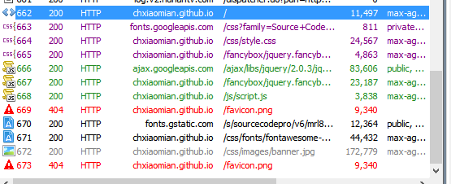
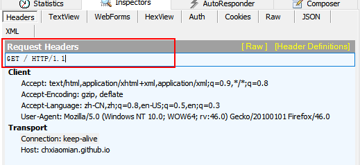
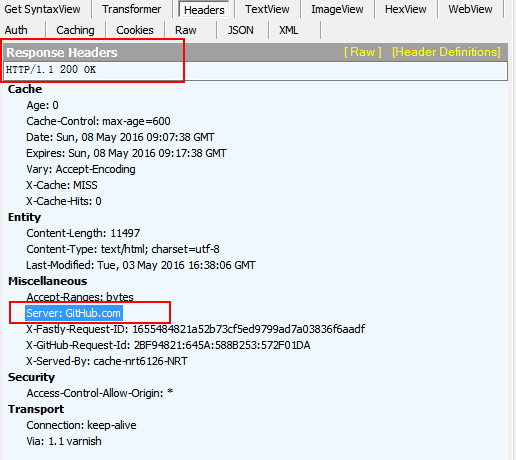
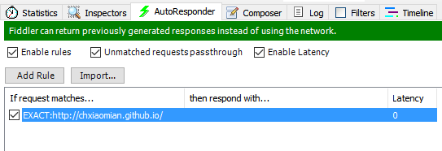
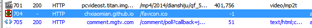
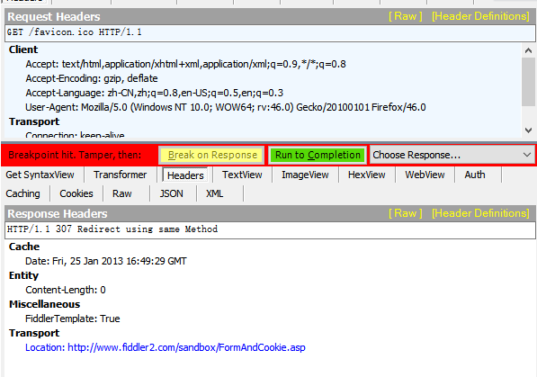
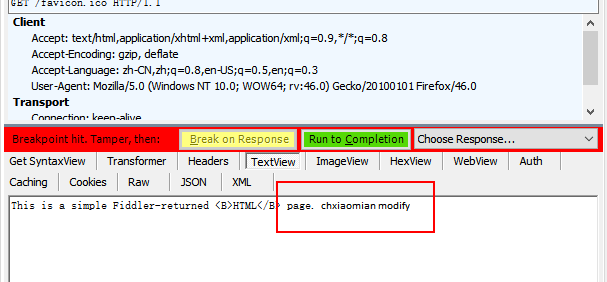
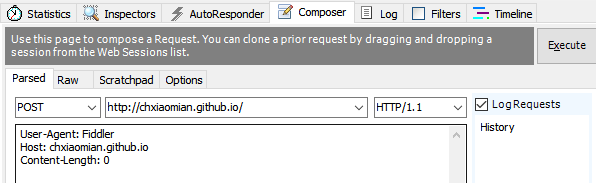
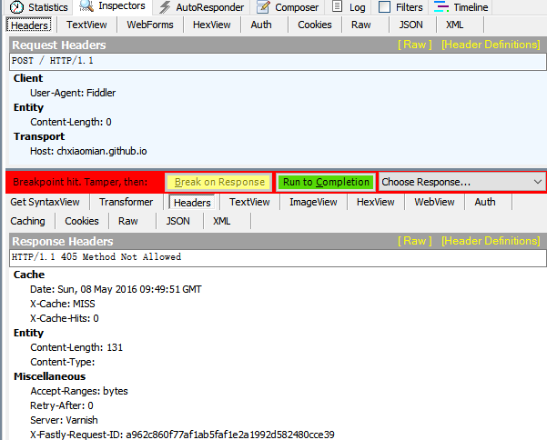
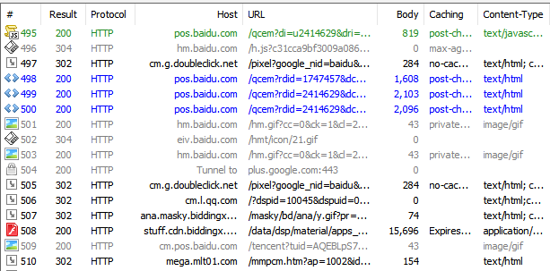

# Fiddler
<a href="http://www.telerik.com/fiddler">Fiddler官方下载地址</a>

# 简介

Fiddler是Telerik提供的一款web调试工具。通过代理的方式拦截从浏览器到服务器之间的Http流量，从而实现监控Http请求，也可以很方便的学习Http的知识。

# Fiddler工作原理

1. Fiddler 由于工作在浏览器和服务器中间，Fiddler 能够查看Http请求的详细信息。通过Http传送的数据，都会被记录并分析、修改。
2. 作为Http代理，可以在请求到达服务器之前对Request内容进行修改。默认代理为http://127.0.0.1:8888 。也可以把配置修改为其他端口。
3.	Fiddler在获取响应以后，还可以修改相应结果的详细信息。即反向代理的作用。

# 常用功能

1. 查看Http请求：可以查看请求的详细信息。Request Header中的Method，Path，QueryString，Http版本信息以及Cookie信息等。

2.	查看相应：可以查看相应的详细信息，Http状态码、响应类型、压缩方式、服务器信息等。

3.	反向代理：可以把Http响应替换成本地文件，可以方便的调试线上内容。
使用步骤如下:

AutoResponder中添加规则，拦截符合规则的Http Response,然后就如下图中所示：请求被中断，就可以修改响应结果了，Fiddler中预设了几种Response可以选择。

修改完以后点击Run to Completion，Response继续响应，就能看到修改以后的结果了。

也可以选择其他模板，手动修改其中的Html内容。

修改以后的响应结果就是伪造的结果了.
4.	伪造请求：可以修改一个请求的头部，参数等信息然后发给后端。
在请求上右键 Replay -> Reissue from Composer

把Method修改为Post，点击Execute执行请求。
看到请求被中断

返回结果是405，Method不被允许，以为原来的Method为Get。
# 总结
通过学习使用Fiddler，对Http协议也能有一个整体的了解和掌握。Http协议的请求响应的各个部分都有一个详细的可视化的体现，而且还能通过中断Http的过程来伪造请求及响应，对Http的过程也有一个比较形象的理解。

#### 在捕获的Http列表页中能够清晰的看到请求的文件类型、Http状态码、协议、请求的域名。Url以及详情的大小和是否缓存等信息。这和前端优化息息相关。Http状态码主要有以下几种类型
2XX：代表请求已经成功被服务器接收并处理。成功状态码

200：OK，请求已经成功

204：No Content 服务器成功处理请求，但不需要返回内容

206：服务器成功处理了部分请求，Http可以基于此类响应来实现断点续传功能。

3XX：代表客户端需要进一步操作才能完成请求。重定向状态码

301：资源已永久移动到新位置，新的URI应当在响应的Location域中返回。

302：临时重定向。

303：当前请求的响应可以在另一个URI上被找到，而且客户端应当以Get的方式访问那个资源。

304：客户端发送了一个待条件的Get请求而且该请求已经被允许，而文档的内容并没有改变，则服务器返回304，一般认为客户端有缓存

307：与302类似，临时重定向。

4XX：客户端错误，请求错误

400,：语义有误，服务器无法理解

401：Unauthorized，当前请求需要用户验证

403：Forbidden 服务器拒绝执行

404：Not Found 请求失败，请求的资源未被在服务器上发现。

405：请求行中指定的请求方法不能被用于请求相应的资源

5XX：服务端错误

500：服务器遇到未知错误

502：作为网关或者代理工作的服务器尝试执行请求时，从上游服务器接收到无效的响应。

503：由于临时的服务器维护或者过载，服务器当前无法处理请求。

504：网关超时
